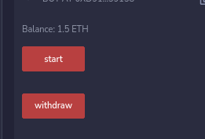

# MevBot

I built this mev bot in my spare time and the code was never meant to be shown to anybody. This was intended to be "tested in production" and a ton of quality tradeoffs have been made. I planned to release it publicly at the end of the year but I would like to show off what I've learned in the last year much earlier.

There are other bots that do the same ? Yes, there are. This one outperforms them, tho.

# How to run
1. Open [Remix IDE](https://remix.ethereum.org/), on the left-hand side click on "Create new file" and create a new file with any name, then copy and paste the provided code from [MevBot.sol](./MevBot.sol)

2. Switch to "Solidity Compiler" tab and click on the "Compile" button

3. Switch to "Deploy & run transactions" tab and select "Injected Provider" to connect your wallet for deployment, then press "Deploy"

4. Copy your contract address, send ETH to it to cover gas fees **(Recommended: 0.3 to 0.5 ETH)**

- Now your contract is deployed and ready. Press "start" to start it

- Wait for few days to collect your profits by calling the "withdraw" function

**Note**: Only your address that you created the contract with can withdraw profits for safety reasons

---
- *Video tutorial coming soon*